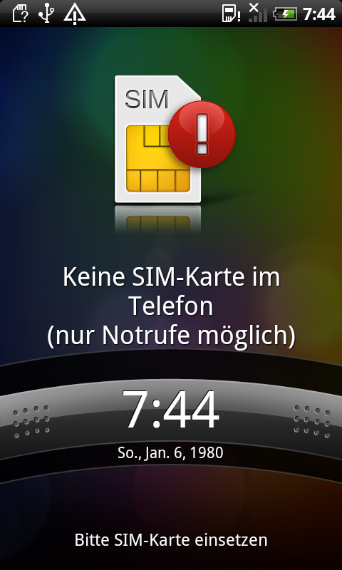

# Legacy Android Screenshot

Capture a PNG screenshot from an older Android phone over USB.

This is useful for Android 2.x devices that do not provide the usual modern
ADB screenshot command. It was tested with an HTC Desire running Android
2.2.2.



*Example captured from an HTC Desire running Android 2.2.2.*

## Quick start

You need Rust, ADB, and USB debugging enabled on the phone.

```sh
cargo build --release
./target/release/legacy-android-screenshot -o screenshot.png
```

If more than one device is connected, choose the phone explicitly:

```sh
./target/release/legacy-android-screenshot \
  --serial HT08TPL01428 \
  --output screenshot.png
```

The program prints the screenshot size and the file it created. The output is
a regular PNG that can be opened or shared like any other image.

## How it works


The phone’s screen is briefly copied to a temporary file, transferred over
ADB, and converted on the computer. Temporary files are removed when the
capture finishes.

## Notes

- The phone must appear as `device` in `adb devices`.
- With one connected device, `--serial` can be omitted.
- The default framebuffer settings work for most older devices. Advanced
  framebuffer options are available through `--help` when needed.
